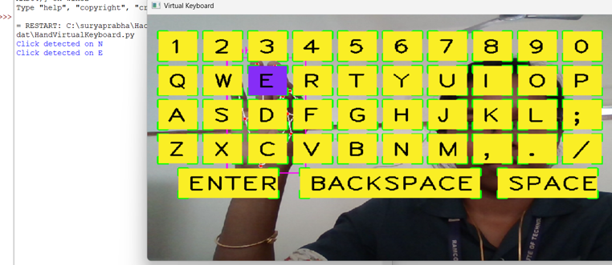

# ✋⌨️ Virtual Hand-Tracking Keyboard
This project is a Python-based **Virtual Keyboard** that uses **hand gestures** via a webcam to simulate typing. It allows users to interact with an on-screen keyboard using only hand movements, ideal for touchless input interfaces.

---

## 📸 Demo

> 👇 Hover your index finger over a key and pinch it with your thumb to simulate a keypress.

  

---

## 🔧 Features

- Real-time hand tracking using webcam
- Interactive on-screen keyboard
- Gesture-based key "press" using finger distance
- Functional special keys: `SPACE`, `ENTER`, `BACKSPACE`
- Visual feedback on hover and keypress
- Modular and customizable layout

---

## 🧠 Technologies Used

- [OpenCV](https://opencv.org/) - Computer vision processing
- [cvzone](https://github.com/cvzone/cvzone) - Simplified OpenCV wrapper
- [MediaPipe](https://google.github.io/mediapipe/) - Hand tracking
- [pynput](https://pypi.org/project/pynput/) - Keyboard control
- [NumPy](https://numpy.org/) - Numeric calculations

---

## ✅ Requirements

Install dependencies using pip:

```bash
pip install opencv-python cvzone pynput numpy keyboard

